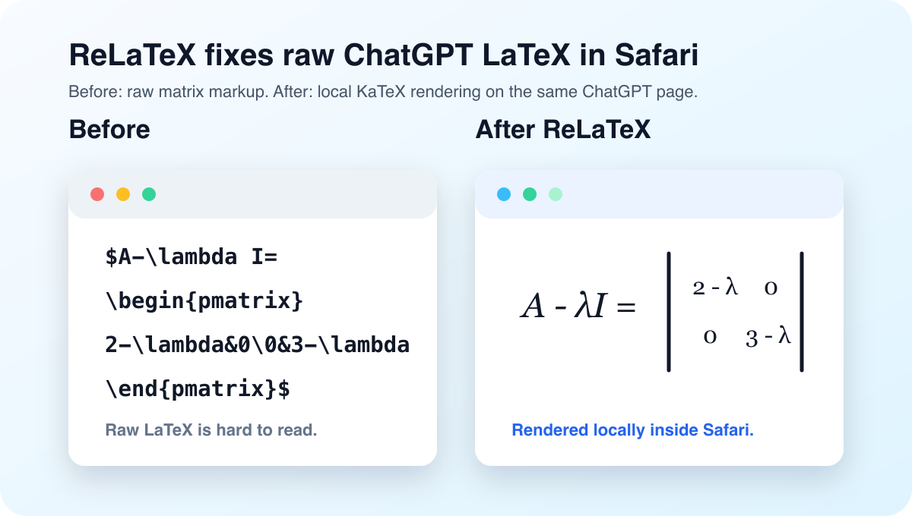

<p align="center">
  
</p>

<h1 align="center">ReLaTeX</h1>

<p align="center">
  一个专门修复 ChatGPT 页面 LaTeX 显示问题的 Safari 扩展。
</p>

<p align="center">
  <a href="https://github.com/Aurxs/ReLaTeX/releases"></a>
  <a href="https://github.com/Aurxs/ReLaTeX/blob/main/LICENSE"></a>
  
  
</p>

<p align="center">
  <a href="#功能">功能</a> ·
  <a href="#安装使用">安装使用</a> ·
  <a href="#开发">开发</a> ·
  <a href="#隐私">隐私</a> ·
  <a href="README.md">English</a>
</p>

---

ReLaTeX 是一个 macOS Safari Web Extension，用来解决 ChatGPT 页面里 LaTeX 公式没有正常渲染、直接显示成原始 `$...$` 文本的问题。它会在 ChatGPT 消息中识别 `$...$`、`\(...\)`、`\[...\]` 和常见矩阵环境，然后用本地打包的 KaTeX 重新渲染出来。



## 功能

- 只在 `chatgpt.com` 和旧域名 `chat.openai.com` 上注入脚本。
- 使用本地 KaTeX 渲染，不依赖 CDN，也不会把公式发到远程服务。
- 支持 ChatGPT 把一个公式拆成多行 DOM 节点的情况。
- 修复常见矩阵行分隔问题，例如 `\begin{pmatrix}1\0\end{pmatrix}`。
- 通过 `MutationObserver` 监听流式输出和后续加载的新消息。
- 自动跳过输入框、按钮、代码块，以及已经渲染过的公式。

## 安装使用

从 GitHub Actions 下载预构建 app：

1. 打开仓库的 **Actions** 页面。
2. 手动运行 **Build macOS App**，或打开最近一次成功运行。
3. 下载 `ReLaTeX-macOS-Release` artifact。
4. 先解压下载下来的 artifact，再解压里面的 `ReLaTeX-macOS-Release.zip`。
5. 打开 `ReLaTeX.app`。

Actions 产物目前没有签名。如果 macOS 阻止打开，解压出 `ReLaTeX.app` 后执行：

```sh
xattr -dr com.apple.quarantine ReLaTeX.app
```

在 Safari 中：

1. 打开 Safari 设置。
2. 进入扩展。
3. 启用 `ReLaTeX for ChatGPT`。
4. 刷新 ChatGPT 页面。

因为这个 app 还没有 Developer ID 签名，Safari 可能仍然需要允许未签名扩展：

1. Safari 设置 -> 高级 -> 显示 Web 开发者功能。
2. Safari 菜单栏 -> 开发 -> 允许未签名扩展。
3. 再次打开 `ReLaTeX.app`。

本地开发时仍然可以从源码构建：

```sh
git clone https://github.com/Aurxs/ReLaTeX.git
cd ReLaTeX
npm install
npm run build:safari
open ReLaTeX/ReLaTeX.xcodeproj
```

在 Xcode 中：

1. 选择 `ReLaTeX` scheme。
2. 运行目标选择 `My Mac`。
3. 点击运行。

## 开发

安装依赖：

```sh
npm install
```

更新 KaTeX 后刷新本地 vendor 文件：

```sh
npm run vendor:katex
```

重新生成 Safari/Xcode 工程：

```sh
npm run build:safari
```

本地构建检查：

```sh
xcodebuild \
  -project ReLaTeX/ReLaTeX.xcodeproj \
  -scheme ReLaTeX \
  -configuration Release \
  -destination 'generic/platform=macOS' \
  -derivedDataPath build/DerivedData \
  CODE_SIGNING_ALLOWED=NO \
  MACOSX_DEPLOYMENT_TARGET=10.14 \
  build
```

## 项目结构

```text
extension/                 Web Extension 源码
extension/content.js       ChatGPT LaTeX 检测和渲染逻辑
extension/vendor/katex/    本地打包的 KaTeX JS、CSS 和字体
ReLaTeX/                   生成的 Safari app 和扩展 Xcode 工程
scripts/                   资源同步和宿主 app 补丁脚本
docs/assets/               README 图片资源
```

## 隐私

ReLaTeX 只在 Safari 本地运行，只申请访问 ChatGPT 页面。它不会把页面文本、公式内容、账号信息或浏览内容发送到任何第三方服务。

## 致谢

ReLaTeX 使用 [KaTeX](https://katex.org/) 进行本地数学公式渲染。

## 许可证

MIT。见 [LICENSE](LICENSE)。
